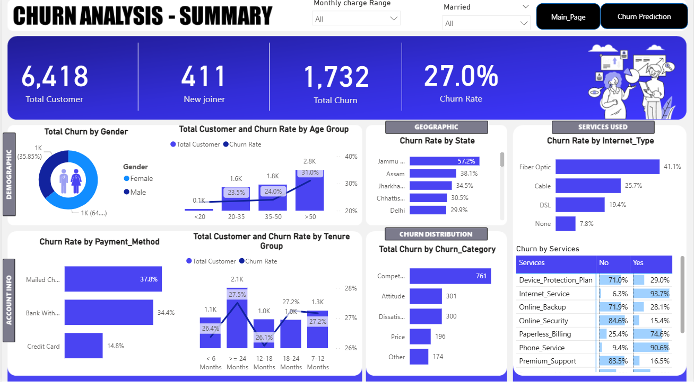
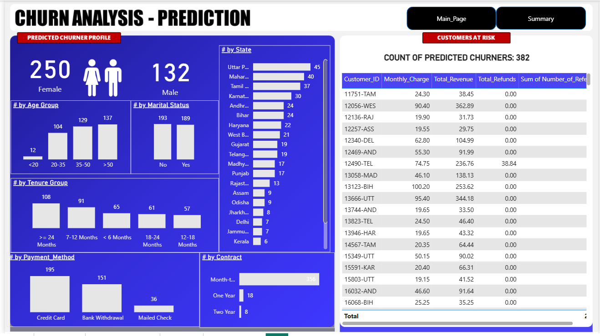

# 📊 Customer Churn Analysis & Prediction System

📊 Business-Focused Churn Analytics & Prediction System for Customer Retention  
📌 End-to-End Project: SQL → Data Analysis → Power BI Dashboard → Machine Learning (Random Forest)  
⭐ Highlight: Identified high-risk customers and key churn drivers impacting retention and revenue  

---

## 🚀 Project Overview

This project is a complete **end-to-end data analytics and machine learning solution** designed to analyze and predict customer churn.

📊 Dataset includes customer demographics, services, and usage behavior  

👉 The goal is to:
- Identify churn patterns  
- Predict customers likely to leave  
- Enable proactive retention strategies  

---

## 🎯 Business Problem

Customer churn directly impacts revenue and growth.

Businesses struggle to:
- Identify why customers leave  
- Predict future churners  
- Take preventive actions  

👉 Key Question:  
**How can businesses reduce churn and improve customer retention?**

---

## 🛠 Tools & Technologies

- SQL – Data Cleaning & Transformation  
- Power BI – Dashboard & Visualization  
- Python (Scikit-learn) – Machine Learning  
- Jupyter Notebook – Model Development  

---

## 🔄 Data Processing (SQL)

- Data exploration using GROUP BY and aggregations  
- Handled missing values  
- Created structured views:
  - `vw_ChurnData`
  - `vw_JoinData`  

---

## 🔄 Data Transformation (Power Query)

- Created churn labels (0/1)  
- Built segmentation features:
  - Age Group  
  - Tenure Group  
- Transformed data for better analysis  

---

## 📊 Power BI Dashboard

### ✔ Key Metrics
- Total Customers  
- New Joiners  
- Total Churn  
- Churn Rate  

---

### ✔ Features
- Interactive filters  
- Customer segmentation  
- Revenue insights  
- Churn trend analysis  

---

## 🤖 Machine Learning Model

Model: **Random Forest Classifier**

### ✔ Steps
- Data preprocessing  
- Encoding  
- Train-test split  
- Model training  
- Evaluation  

### ✔ Evaluation Metrics
- Confusion Matrix  
- Classification Report  

👉 Predicts customers likely to churn and identifies high-risk segments  

---

## 📊 Key Insights

- Customers with shorter tenure are more likely to churn  
- Higher monthly charges increase churn probability  
- Contract type strongly impacts retention  
- Certain services reduce churn risk  

---

## 💡 Business Recommendations

- Target high-risk customers with retention offers  
- Provide incentives for long-term contracts  
- Optimize pricing for high-charge customers  
- Promote services that improve retention  

---

## 📷 Dashboard Preview

  
  

---

## 🎯 Impact

- Identified key churn drivers affecting customer retention  
- Built predictive model to detect high-risk customers  
- Enabled proactive retention strategies  
- Supported data-driven decision making  

---

## ⭐ Future Enhancements

- Deploy model using Flask / Streamlit  
- Automate data pipeline  
- Use advanced models (XGBoost, LightGBM)  
- Real-time churn prediction  

---

## 👨‍💻 Author

**Chandan Kumar Sah**  
Data Analyst | SQL • Power BI • Python • Machine Learning  

---

⭐ If you found this project useful, consider giving it a **star**
